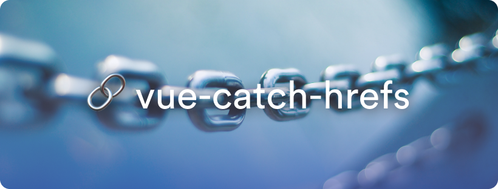

<p align="center">

</p>

---

# vue-catch-hrefs

This plugin aims to catch clicks on `<a href="...">` links referring to your app from user generated content in order to redirect them to your local vue-router.

This can be useful to parse links that you add to content from a headless cms, or from any API you consume.

Listening to the whole DOM allows us to trigger routing to the app from anywhere on the DOM, including outside your Vue app if it is bundled inside a page.

You can manipulate data and cancel events easily with the global event bus or with your path formatter.

## Installation

Install the plugin from your favorite package manager.

```bash
npm install vue-catch-hrefs
```

Install the plugin in your app.

```javascript
// Setup your router somehow [...]
import router from "./router"
// VueCatchHrefs imports
import VueCatchHrefs from "vue-catch-hrefs"
import pathFormatter from "~/your-plugins-path/pathFormatter"

Vue.use(VueCatchHrefs, router, pathFormatter)
```

## Usage

The plugin listens to your apps clicks on <a> elements.

From that, it catches up the href location and matches it with your app url.

If it does, then the content of the href is routed to your vue-router instance.

You can catch the content of the matched link from anywhere in your app using the global event bus.

You can also format the path using your own parameters with your own formatter.

### Global event bus

The event bus can be used to listen the anchor links on the page and redirect them to your router or trigger action in components with it.

```javascript
// ~/components/YourComponent.vue
import { routeEventBus } from "vue-catch-hrefs"

export default {
  name: "YourComponent",

  mounted() {
    routeEventBus.$on("href", ({ path, from, event }) => {
      // Your data manipulation...
      console.log({ 
         path, // The path matched after formatting
         from, // The <a> element matched
         event // The MouseEvent caught
      })
    })
  }
}
```

### Path formatter

The path formatter can be used to manipulate the data and/or cancel the redirection.

The formatter must return a string value, corresponding to the path that will be sent to your router, or `false` that will cancel the redirection and fire the original click on the href.

```javascript
// ~/plugins/vue-catch-hrefs/path-formatter.js
export default (path, currentRoute) => {
  // Remove the query params after the first one
  if (path.indexOf("&") > -1) {
    path = path.substring(0, path.indexOf("&"))
  }
  
  // If the link is an anchor path, cancel the redirection.
  // This click will be handled through component event listener.
  if (currentRoute.path + "#" === path) {
    return false
  }

  // Return the path
  return path
}
```

Once you have written your own path formatter, you have to add it to the plugin initialization.

To do so, pass it as a parameter in your `Vue.use` instruction.

## Examples of usage

I'm using this plugin on [Zouw.app](https://zouw.app) to parse timecodes used in YouTube HTML descriptions from the YouTube API.

I'm also using it to re-route original YouTube links to my app.

I can listen to the events from the caught links clicks with the global event bus, and interact with the YouTube player using the data inside the original YouTube URL.

I also tried it on my personal website [yael.dev](https://yael.dev), which is rendering HTML content from DatoCMS with Nuxt, and it works.

### Credits

[Yaël GUILLOUX](mailto:yael.guilloux@gmail.com)

## License

The MIT License (MIT). Please see [License File](LICENSE) for more information.